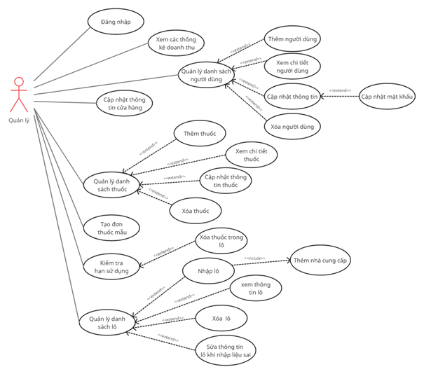
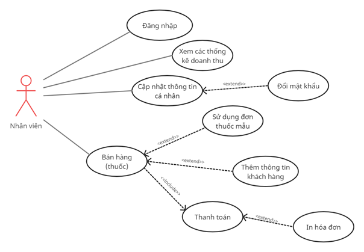
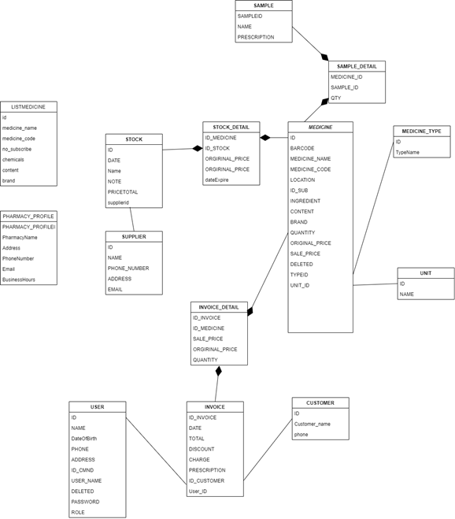
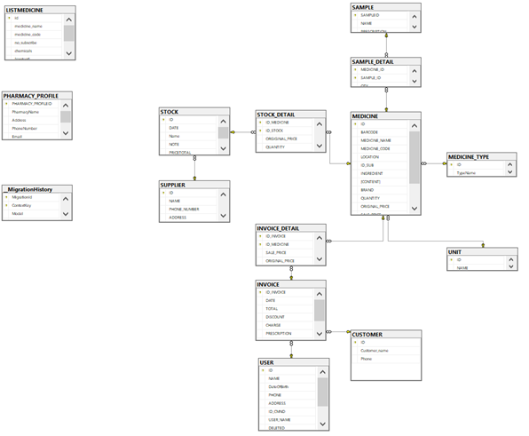
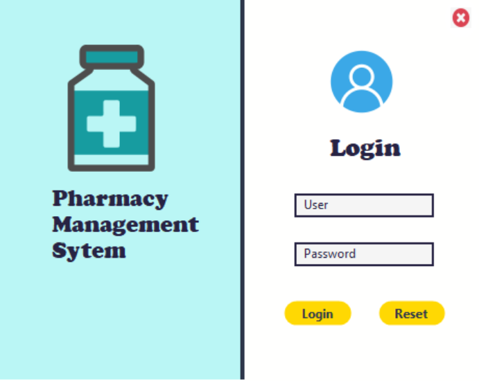
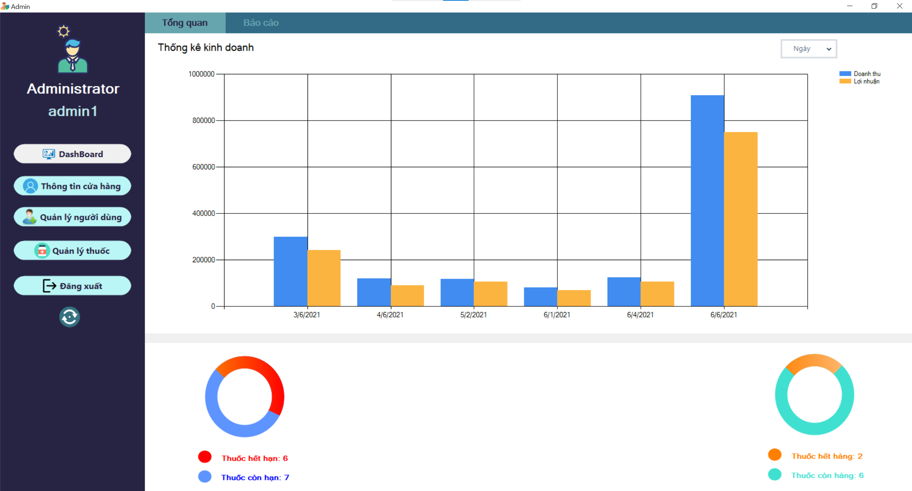
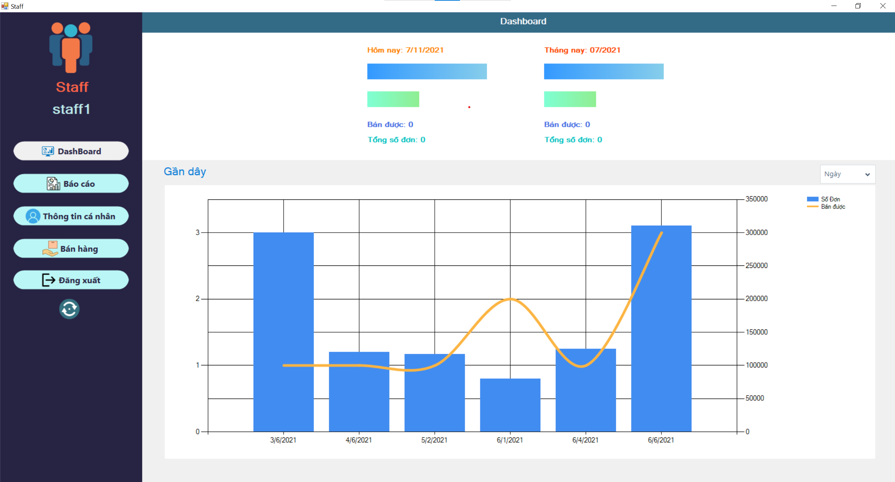
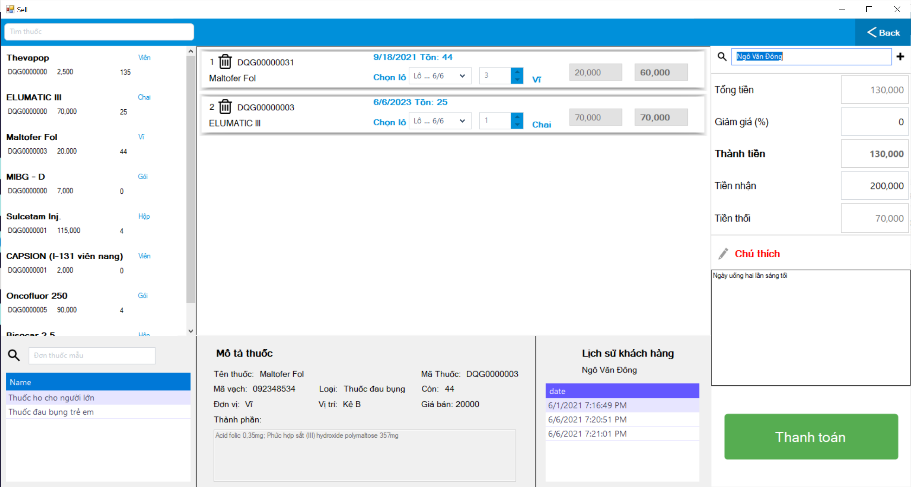

# Pharmacy management sytem
>This is my third project in university with my team.


## Table of Contents
* [General Info](#general-information)
* [Technologies Used](#technologies-used)
* [Features](#features)
* [Design](#Design)
* [Screenshots](#screenshots)
* [Setup](#setup)
* [Usage](#usage)


## General Information
- Through this project, I cant brush up my knowledge on C#/.NET Winform, OOP, Entity FrameWork
- Application of the project is to help the owner pharmacy can manage pharmacy as well as manage staff. In addition, the application also helps staff cant sell medicine conveniently.


## Technologies Used
- Language: C#/.Net
-  Graphical class library: Windows Forms
- Entity Framework 6 (.NET Framework)
- nudget package: guna2


## Features

- Manager: 
  - CRUD Staff
  - CRUD medicine
  - View revenue
  - Edit pharmacy infor
  - Check validate medicine
  - Import stock
  - Create prescription sample
- Staff:
  - Edit theirs profile
  - View personal revenue
  - Sell medicine
 

## Design

### Project is divided into three-layer:
  1. DAL(Data access layer)
  2. BLL(Business logic layer)
  3. UI(User interface)
### Project has two parts one is for a manager, the other is for staff.

### Usercase:
  
  
  






### Class diagram





### Schema





## Screenshots


### Login Form





### Admin Form





### Staff Form





### Sell Form





## Setup

**How to run the Project:**

1. Clone this repo using

  ```git clone https://github.com/ngovandong/PBL3```
  
2. Run file data/backup.sql in sql server
3. Change connection string in file /DAL/PharmacyModel.cs


  ``` 
    public PharmacyModel()
            : base("data source=dongdong\\SQLEXPRESS;initial catalog=doan3;integrated security=True;MultipleActiveResultSets=True;App=EntityFramework")
  ```
 
  Change `dongdong` to your desktop user
 4. Debug

## Usage

**Default Admin account**
  > User: `Admin1`
  > 
  > Password: `1234`
  
  
**Default Staff account**
  > User: `Staff1`
  > 
  > Password: `1234`
  
